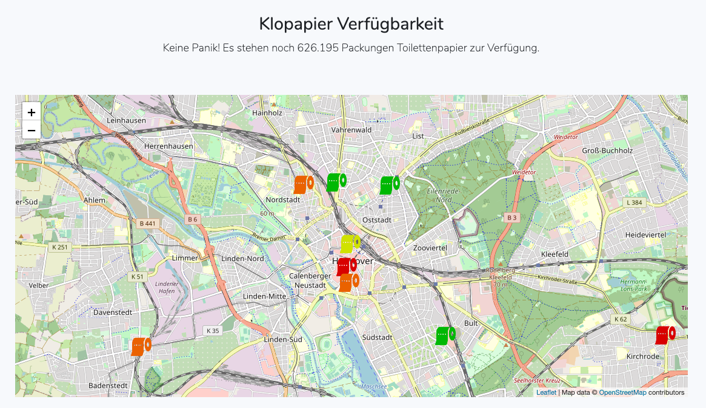

# Toiletpaper Availability

[](https://www.codacy.com/gh/MrKrisKrisu/toilet-paper-availability/dashboard?utm_source=github.com&amp;utm_medium=referral&amp;utm_content=MrKrisKrisu/toilet-paper-availability&amp;utm_campaign=Badge_Grade)



Because of COVID-19, people are buying a lot more toilet paper then normal. 
It's weird, but they do.
This application will help you to find nearby drug stores where toilet paper is available.

https://klopapier-verfuegbarkeit.de/

## Installation
You'll need Composer and PHP >= 7.3.

Just pull the repo and run the following commands:

- `composer install`
- `php artisan key:generate`
- `wget -O database/seeders/dmstores.json https://store-data-service.services.dmtech.com/stores/bbox/49.091271000000745%2C7.276695738013274%2C49.002137000001056%2C9.56446326198315` 
- `php artisan migrate --seed`
- `php artisan tpa:fetch`

To pull the data you need to set up a cronjob which will call ```php artisan schedule:run``` every minute.

## Contributors
Thanks to [HerrLevin](https://github.com/HerrLevin) for helping me to find a list of all drug stores
